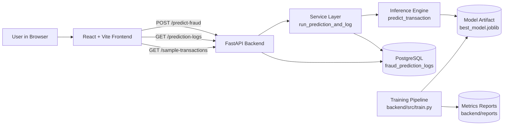

### Project Architecture and Request Flow Guide

This document explains how the project is structured, how requests move through the system, how the ML model is trained, how the database is created/migrated, and what interview questions you can expect.

### 1) High-Level System Architecture



### 2) Directory-by-Directory Structure

### Root

- `README.md`
  - Product-facing overview, setup instructions, and API quick-start.
- `PROJECT_ARCHITECTURE.md`
  - Detailed engineering architecture and flow reference (this file).
- `docker-compose.yml`
  - Multi-container orchestration (`postgres`, `backend`, `frontend`).

### `backend/`

- `Dockerfile`
  - Builds backend image with dependencies and app code.
- `entrypoint.sh`
  - Runtime bootstrap for backend container.
  - Runs `alembic upgrade head` and then starts `uvicorn`.
- `requirements.txt`
  - Python dependencies for API, ML, DB, and tests.
- `alembic.ini`
  - Alembic configuration.

#### `backend/app/` (Application Layer)

- `main.py`
  - FastAPI app initialization and CORS setup.
- `api/`
  - HTTP endpoints (`/predict-fraud`, `/prediction-logs`, `/sample-transactions`).
- `schemas/`
  - Pydantic request/response models and API contracts.
- `services/`
  - Business-service orchestration (run prediction + persist logs).
  - Contains sample payload provider for scenario testing.
- `db/`
  - SQLAlchemy model definitions, DB URL resolution, and session handling.

#### `backend/src/` (ML Pipeline Layer)

- `data_loader.py`
  - Loads dataset (`creditcard.csv`) with synthetic fallback.
- `preprocessing.py`
  - Cleans data, handles missing values, performs train/test prep.
- `train.py`
  - Trains candidate models, evaluates, selects best, stores artifact.
- `evaluate.py`
  - Metrics, model comparison utilities, and threshold selection support.
- `predict.py`
  - Inference using trained model + scaler + decision threshold.
- `utils.py`
  - Shared constants and reusable helper functions (e.g., feature order).

#### `backend/alembic/`

- `env.py`
  - Runtime migration environment setup.
  - Reads DB URL and applies migration context.
- `versions/`
  - Versioned migration scripts.
  - Includes table creation for `fraud_prediction_logs`.

#### Other backend folders

- `backend/data/`
  - Input datasets (`creditcard.csv`, optional experiment files).
- `backend/models/`
  - Saved trained model artifact (`best_model.joblib`).
- `backend/reports/`
  - Model evaluation outputs (metrics report JSON).
- `backend/tests/`
  - API and ML pipeline test cases.

### `frontend/`

- `package.json`
  - JavaScript dependencies and scripts.
- `vite.config.js`
  - Vite dev/build configuration.
- `index.html`
  - Vite HTML entrypoint.

#### `frontend/src/`

- `main.jsx`, `App.jsx`
  - React bootstrap and top-level composition.
- `pages/FraudDashboard.jsx`
  - Main dashboard page and orchestration of widgets.
- `components/`
  - Input form, charts, result card, metrics card, transaction log table.
- `services/api.js`
  - API client calls to backend endpoints.
- `styles.css`
  - UI styling and interaction presentation.

### 3) Request Lifecycle (What Happens on `POST /predict-fraud`)

1. User enters `Time`, `V1..V28`, and `Amount` in UI.
2. Frontend calls backend endpoint `POST /predict-fraud` with JSON payload.
3. FastAPI validates payload via `FraudPredictionRequest` schema.
4. Route delegates to service function (`run_prediction_and_log`).
5. Service calls inference (`predict_transaction`) in ML layer.
6. Inference:
   - Reorders payload to expected feature order.
   - Applies saved `StandardScaler`.
   - Predicts fraud probability from loaded model artifact.
   - Applies learned decision threshold to produce `Fraud`/`Not Fraud` label.
   - Maps probability to risk bucket (`Low`/`Medium`/`High`).
7. Service stores prediction details in PostgreSQL (`fraud_prediction_logs`).
8. API returns prediction response to frontend.
9. Frontend updates UI and can fetch latest logs via `GET /prediction-logs`.

### 4) Model Training Flow (How the Model Was Trained)

#### E2E Training Control Flow

```text
|--------------------------------------------------------------------------------|
|                    FRAUD DETECTION TRAINING SERVICE FLOW                       |
|--------------------------------------------------------------------------------|

Developer
   |
   | runs
   v
|--------------------------------------------------------------------------------|
| python backend/src/train.py                                                    |
|--------------------------------------------------------------------------------|
   |
   v
|--------------------------------------------------------------------------------|
| backend/src/train.py                                                           |
| __main__ entry point                                                           |
|--------------------------------------------------------------------------------|
   |
   v
|--------------------------------------------------------------------------------|
| train_and_select_best_model()                                                  |
| Main training orchestration function                                           |
|--------------------------------------------------------------------------------|
   |
   v
|--------------------------------------------------------------------------------|
| src.utils.ensure_dirs()                                                        |
| Creates required folders:                                                      |
| - backend/models/                                                              |
| - backend/reports/                                                             |
|--------------------------------------------------------------------------------|
   |
   v
|--------------------------------------------------------------------------------|
| src.data_loader.load_transaction_data()                                        |
| Loads the training dataset used by the fraud model                             |
|--------------------------------------------------------------------------------|
   |
   v
|--------------------------------------------------------------------------------|
| Dataset source decision                                                        |
| - If backend/data/creditcard.csv exists: load it with pandas.read_csv()        |
| - Otherwise: call _build_synthetic_dataset() for local fallback data           |
|--------------------------------------------------------------------------------|
   |
   v
|--------------------------------------------------------------------------------|
| Raw transaction DataFrame                                                      |
| Expected columns: Time, V1..V28, Amount, Class                                 |
| Class is the fraud/non-fraud target label                                      |
|--------------------------------------------------------------------------------|
   |
   v
|--------------------------------------------------------------------------------|
| src.preprocessing.preprocess_data(df)                                           |
| Cleans, splits, scales, and balances the dataset                                |
|--------------------------------------------------------------------------------|
   |
   v
|--------------------------------------------------------------------------------|
| Data cleaning                                                                   |
| - Drop duplicate rows                                                           |
| - Fill missing numeric values with column medians                               |
| - Separate features from target label                                           |
|--------------------------------------------------------------------------------|
   |
   v
|--------------------------------------------------------------------------------|
| train_test_split()                                                              |
| Creates stratified train/test partitions                                        |
| - 80% training data                                                             |
| - 20% test data                                                                 |
|--------------------------------------------------------------------------------|
   |
   v
|--------------------------------------------------------------------------------|
| StandardScaler                                                                  |
| - Fit scaler on training features                                               |
| - Transform training features                                                   |
| - Transform test features using the same scaler                                 |
|--------------------------------------------------------------------------------|
   |
   v
|--------------------------------------------------------------------------------|
| SMOTE class balancing decision                                                  |
| - If imbalanced-learn is available: apply SMOTE to the training set             |
| - Otherwise: continue with scaled training data                                 |
|--------------------------------------------------------------------------------|
   |
   v
|--------------------------------------------------------------------------------|
| PreprocessArtifacts                                                             |
| Returned training bundle:                                                       |
| - X_train_resampled                                                             |
| - y_train_resampled                                                             |
| - X_test_scaled                                                                 |
| - y_test                                                                        |
| - scaler                                                                        |
|--------------------------------------------------------------------------------|
   |
   v
|--------------------------------------------------------------------------------|
| Candidate model registry                                                        |
| Models configured by train.py:                                                  |
| - LogisticRegression                                                            |
| - XGBClassifier, when xgboost imports successfully                              |
|--------------------------------------------------------------------------------|
   |
   v
|--------------------------------------------------------------------------------|
| Candidate training loop                                                         |
| For each model candidate:                                                       |
| - model.fit(X_train_resampled, y_train_resampled)                               |
| - pass trained model to evaluation step                                         |
|--------------------------------------------------------------------------------|
   |
   v
|--------------------------------------------------------------------------------|
| src.evaluate.evaluate_model()                                                   |
| Computes model quality metrics:                                                 |
| - Accuracy                                                                      |
| - Precision                                                                     |
| - Recall                                                                        |
| - F1 score                                                                      |
| - ROC-AUC                                                                       |
| - Precision-recall curve                                                        |
| - Confusion matrix                                                              |
|--------------------------------------------------------------------------------|
   |
   v
|--------------------------------------------------------------------------------|
| src.evaluate.ranking_score()                                                    |
| Calculates fraud-focused weighted score:                                        |
| - Recall: 35%                                                                   |
| - Precision: 25%                                                                |
| - F1 score: 25%                                                                 |
| - ROC-AUC: 15%                                                                  |
|--------------------------------------------------------------------------------|
   |
   v
|--------------------------------------------------------------------------------|
| Best model selection                                                            |
| train.py tracks the candidate with the highest ranking_score()                  |
|--------------------------------------------------------------------------------|
   |
   v
|--------------------------------------------------------------------------------|
| src.evaluate.best_f1_threshold()                                                |
| Finds the probability decision threshold that maximizes F1 on test data         |
|--------------------------------------------------------------------------------|
   |
   v
|--------------------------------------------------------------------------------|
| Model artifact construction                                                     |
| Artifact contents:                                                              |
| - model                                                                         |
| - scaler                                                                        |
| - model_name                                                                    |
| - model_version                                                                 |
| - decision_threshold                                                            |
|--------------------------------------------------------------------------------|
   |
   v
|--------------------------------------------------------------------------------|
| joblib.dump()                                                                   |
| Saves trained inference artifact to:                                            |
| backend/models/best_model.joblib                                                |
|--------------------------------------------------------------------------------|
   |
   v
|--------------------------------------------------------------------------------|
| Report payload construction                                                     |
| Report contents:                                                               |
| - selected_model                                                                |
| - model_version                                                                 |
| - decision_threshold                                                            |
| - selection_score                                                               |
| - metrics by candidate model                                                    |
|--------------------------------------------------------------------------------|
   |
   v
|--------------------------------------------------------------------------------|
| src.utils.write_json()                                                          |
| Writes model reports to:                                                        |
| - backend/reports/metrics_report.json                                           |
| - backend/reports/evaluation_report.json                                        |
|--------------------------------------------------------------------------------|
   |
   v
|--------------------------------------------------------------------------------|
| Training result                                                                 |
| - Returns report_payload                                                        |
| - Prints selected_model from __main__                                           |
| - best_model.joblib is ready for src.predict.predict_transaction()              |
|--------------------------------------------------------------------------------|
```

The training pipeline is a command-style control flow, not a web request. `train.py` owns orchestration, delegates data loading to `data_loader.py`, preprocessing to `preprocessing.py`, metric and threshold logic to `evaluate.py`, and file-system paths/report writing to `utils.py`. Its durable outputs are the inference artifact at `backend/models/best_model.joblib` and the model reports under `backend/reports/`.

1. **Load data** from `backend/data/creditcard.csv`.
2. **Preprocess**: deduplicate, handle missing values, split features/labels.
3. **Scale and split**: prepare train/test sets.
4. **Handle imbalance**: apply `SMOTE` to training data.
5. **Train candidates**:
   - `LogisticRegression`
   - `XGBClassifier` when `xgboost` imports successfully
6. **Evaluate** using fraud-relevant metrics (`Precision`, `Recall`, `F1`, `ROC-AUC`).
7. **Select best model** by weighted ranking (not plain accuracy).
8. **Calibrate decision threshold** (stored in artifact as `decision_threshold`).
9. **Persist artifact** (`model`, `scaler`, `model_name`, `model_version`, `decision_threshold`) via `joblib`.
10. **Write reports** to `backend/reports/metrics_report.json`.

#### API Entrypoint to Training Fallback Control Flow

```text
|--------------------------------------------------------------------------------|
|              FRAUD DETECTION API TO MODEL TRAINING FALLBACK FLOW               |
|--------------------------------------------------------------------------------|

Developer
   |
   | starts API application
   v
|--------------------------------------------------------------------------------|
| python backend/app/main.py                                                      |
| Normal runtime is typically uvicorn app.main:app from the backend folder        |
|--------------------------------------------------------------------------------|
   |
   v
|--------------------------------------------------------------------------------|
| backend/app/main.py                                                             |
| FastAPI application entry module                                                |
| Creates app = FastAPI(...)                                                      |
|--------------------------------------------------------------------------------|
   |
   v
|--------------------------------------------------------------------------------|
| app.add_middleware(CORSMiddleware, ...)                                         |
| Enables frontend/backend browser calls                                          |
|--------------------------------------------------------------------------------|
   |
   v
|--------------------------------------------------------------------------------|
| app.include_router(fraud_router)                                                |
| Registers all routes from backend/app/api/fraud_routes.py                       |
|--------------------------------------------------------------------------------|
   |
   v
|--------------------------------------------------------------------------------|
| Registered API routes                                                           |
| - GET  /                                                                        |
| - POST /predict-fraud                                                           |
| - GET  /prediction-logs                                                         |
| - GET  /sample-transactions                                                     |
|--------------------------------------------------------------------------------|
   |
   v
|--------------------------------------------------------------------------------|
| Route branch decision                                                           |
| The request path determines which fraud_routes.py handler runs                  |
|--------------------------------------------------------------------------------|
   |
   +------------------------------+
   |                              |
   | GET /                        |
   v                              |
|--------------------------------------------------------------------------------|
| backend/app/main.py::health()                                                   |
| Returns service health payload: {"status": "ok", ...}                          |
|--------------------------------------------------------------------------------|

   +------------------------------+
   |                              |
   | GET /sample-transactions     |
   v                              |
|--------------------------------------------------------------------------------|
| fraud_routes.py::sample_transactions()                                          |
| Calls app.services.sample_payloads.get_sample_transactions()                    |
| Returns curated low/medium/high sample payloads for UI and API testing          |
|--------------------------------------------------------------------------------|

   +------------------------------+
   |                              |
   | GET /prediction-logs         |
   v                              |
|--------------------------------------------------------------------------------|
| fraud_routes.py::prediction_logs(limit, db)                                     |
| FastAPI validates query limit and opens DB session with get_db()                |
|--------------------------------------------------------------------------------|
   |
   v
|--------------------------------------------------------------------------------|
| app.services.fraud_service.get_prediction_logs(db, limit)                       |
| Queries fraud_prediction_logs ordered by created_at descending                  |
| Returns recent prediction audit records                                         |
|--------------------------------------------------------------------------------|

   +------------------------------+
   |                              |
   | POST /predict-fraud          |
   v                              |
|--------------------------------------------------------------------------------|
| fraud_routes.py::predict_fraud(payload, db)                                     |
| FastAPI validates request body with FraudPredictionRequest                       |
| FastAPI opens request-scoped DB session with get_db()                           |
|--------------------------------------------------------------------------------|
   |
   v
|--------------------------------------------------------------------------------|
| payload.model_dump()                                                            |
| Converts validated Pydantic request into a Python dict                          |
| Expected fields: Time, V1..V28, Amount                                          |
|--------------------------------------------------------------------------------|
   |
   v
|--------------------------------------------------------------------------------|
| app.services.fraud_service.run_prediction_and_log(payload, db)                  |
| Coordinates ML inference and database persistence                               |
|--------------------------------------------------------------------------------|
   |
   v
|--------------------------------------------------------------------------------|
| src.predict.predict_transaction(payload)                                        |
| Runs fraud scoring for a single transaction                                     |
|--------------------------------------------------------------------------------|
   |
   v
|--------------------------------------------------------------------------------|
| src.predict.load_model_artifact()                                               |
| Looks for backend/models/best_model.joblib                                      |
|--------------------------------------------------------------------------------|
   |
   v
|--------------------------------------------------------------------------------|
| Model artifact decision                                                         |
| - If best_model.joblib exists: load it with joblib.load()                       |
| - If missing: call src.train.train_and_select_best_model()                      |
|--------------------------------------------------------------------------------|
   |
   v
|--------------------------------------------------------------------------------|
| Missing model fallback: train_and_select_best_model()                           |
| The API request now triggers the same training pipeline used by train.py        |
|--------------------------------------------------------------------------------|
   |
   v
|--------------------------------------------------------------------------------|
| src.utils.ensure_dirs()                                                         |
| Creates required folders:                                                       |
| - backend/models/                                                               |
| - backend/reports/                                                              |
|--------------------------------------------------------------------------------|
   |
   v
|--------------------------------------------------------------------------------|
| src.data_loader.load_transaction_data()                                         |
| Loads backend/data/creditcard.csv when present                                  |
| Falls back to _build_synthetic_dataset() when the CSV is missing                |
|--------------------------------------------------------------------------------|
   |
   v
|--------------------------------------------------------------------------------|
| Raw transaction DataFrame                                                       |
| Expected training columns: Time, V1..V28, Amount, Class                         |
|--------------------------------------------------------------------------------|
   |
   v
|--------------------------------------------------------------------------------|
| src.preprocessing.preprocess_data(df)                                           |
| - Drops duplicate rows                                                          |
| - Fills missing numeric values with medians                                     |
| - Splits features from Class target                                             |
|--------------------------------------------------------------------------------|
   |
   v
|--------------------------------------------------------------------------------|
| train_test_split()                                                              |
| Builds stratified train/test sets                                               |
| - 80% training data                                                             |
| - 20% test data                                                                 |
|--------------------------------------------------------------------------------|
   |
   v
|--------------------------------------------------------------------------------|
| StandardScaler                                                                  |
| - Fits on training features                                                     |
| - Transforms training features                                                  |
| - Transforms test features with the same fitted scaler                          |
|--------------------------------------------------------------------------------|
   |
   v
|--------------------------------------------------------------------------------|
| SMOTE class balancing decision                                                  |
| - If imbalanced-learn is available: fit_resample() on training data             |
| - Otherwise: continue with scaled training data                                 |
|--------------------------------------------------------------------------------|
   |
   v
|--------------------------------------------------------------------------------|
| Candidate model registry                                                        |
| Models configured by train.py:                                                  |
| - LogisticRegression                                                            |
| - XGBClassifier, when xgboost imports successfully                              |
|--------------------------------------------------------------------------------|
   |
   v
|--------------------------------------------------------------------------------|
| Candidate training loop                                                         |
| Each candidate model runs model.fit(X_train_resampled, y_train_resampled)       |
|--------------------------------------------------------------------------------|
   |
   v
|--------------------------------------------------------------------------------|
| src.evaluate.evaluate_model()                                                   |
| Calculates accuracy, precision, recall, F1, ROC-AUC, PR curve, confusion matrix |
|--------------------------------------------------------------------------------|
   |
   v
|--------------------------------------------------------------------------------|
| src.evaluate.ranking_score()                                                    |
| Scores candidates with fraud-focused weights                                    |
| Recall 35%, precision 25%, F1 25%, ROC-AUC 15%                                  |
|--------------------------------------------------------------------------------|
   |
   v
|--------------------------------------------------------------------------------|
| Best model selection                                                            |
| Keeps the candidate with the highest ranking_score()                            |
|--------------------------------------------------------------------------------|
   |
   v
|--------------------------------------------------------------------------------|
| src.evaluate.best_f1_threshold()                                                |
| Finds the probability decision threshold that maximizes F1                      |
|--------------------------------------------------------------------------------|
   |
   v
|--------------------------------------------------------------------------------|
| joblib.dump(model_artifact, backend/models/best_model.joblib)                   |
| Saves model, scaler, model_name, model_version, and decision_threshold          |
|--------------------------------------------------------------------------------|
   |
   v
|--------------------------------------------------------------------------------|
| src.utils.write_json()                                                          |
| Writes training reports:                                                        |
| - backend/reports/metrics_report.json                                           |
| - backend/reports/evaluation_report.json                                        |
|--------------------------------------------------------------------------------|
   |
   v
|--------------------------------------------------------------------------------|
| Return to src.predict.load_model_artifact()                                     |
| Loads the newly created best_model.joblib with joblib.load()                    |
|--------------------------------------------------------------------------------|
   |
   v
|--------------------------------------------------------------------------------|
| Inference preparation                                                           |
| - Extract model, scaler, and decision_threshold from artifact                   |
| - Reorder request payload using FEATURE_COLUMNS                                 |
| - Build one-row pandas DataFrame                                                |
|--------------------------------------------------------------------------------|
   |
   v
|--------------------------------------------------------------------------------|
| scaler.transform(features)                                                      |
| Applies the training-time scaler to the incoming transaction                    |
|--------------------------------------------------------------------------------|
   |
   v
|--------------------------------------------------------------------------------|
| model.predict_proba(scaled)                                                     |
| Calculates fraud_probability for the transaction                                |
|--------------------------------------------------------------------------------|
   |
   v
|--------------------------------------------------------------------------------|
| Threshold and risk mapping                                                      |
| - fraud_probability >= decision_threshold means Fraud                           |
| - otherwise Not Fraud                                                           |
| - risk_from_probability() maps probability to Low, Medium, or High              |
|--------------------------------------------------------------------------------|
   |
   v
|--------------------------------------------------------------------------------|
| Prediction response from src.predict.predict_transaction()                      |
| Returns prediction_label, fraud_probability, risk_level, model_version          |
|--------------------------------------------------------------------------------|
   |
   v
|--------------------------------------------------------------------------------|
| app.services.fraud_service.run_prediction_and_log()                             |
| Creates FraudPredictionLog ORM object                                           |
| Stores amount, probability, label, risk, model_version, and request payload     |
|--------------------------------------------------------------------------------|
   |
   v
|--------------------------------------------------------------------------------|
| db.add(log) -> db.commit() -> db.refresh(log)                                   |
| Persists prediction audit record in fraud_prediction_logs                       |
|--------------------------------------------------------------------------------|
   |
   v
|--------------------------------------------------------------------------------|
| API response                                                                    |
| POST /predict-fraud returns the prediction payload to the frontend/client       |
|--------------------------------------------------------------------------------|
```

### 5) Libraries Used and Why

- `FastAPI`: high-performance API framework with Pydantic validation.
- `SQLAlchemy`: ORM for DB interactions and model persistence mapping.
- `Alembic`: migration/versioning for repeatable schema evolution.
- `pandas`/`numpy`: data processing and matrix operations.
- `scikit-learn`: preprocessing, baseline modeling, metrics.
- `xgboost`: boosted tree model candidate for tabular fraud data.
- `imbalanced-learn` (`SMOTE`): improves learning signal on rare fraud class.
- `joblib`: serializes/deserializes trained artifacts.
- `React` + `Vite`: modern frontend rendering and fast dev workflow.
- `Recharts`: model-facing visualization components.

### 6) How Database Is Created and Used

### Creation/Migration

- Schema is controlled by Alembic migration scripts.
- In Docker flow:
  - `entrypoint.sh` automatically runs `alembic upgrade head` before API startup.
- In local flow:
  - Run `alembic upgrade head` manually from `backend/`.

### Runtime usage

- Backend stores each prediction in `fraud_prediction_logs` table.
- This table supports traceability, monitoring, and UI history display.

### 7) How Calls Are Made (Terminal and PyCharm)

### Terminal

```bash
curl -X GET "http://localhost:8000/sample-transactions"
```

```bash
curl -X POST "http://localhost:8000/predict-fraud" \
  -H "Content-Type: application/json" \
  -d '{"Time":865, "V1":-0.5374802762, "V2":8.5411202134, "V3":1.7172749111, "V4":-1.142444037, "V5":0.8710858686, "V6":-2.379534301, "V7":3.6324085605, "V8":1.4689942064, "V9":2.3140508421, "V10":0.6080150786, "V11":3.7338869247, "V12":-0.2240221028, "V13":-1.2259402182, "V14":-0.1872434624, "V15":0.6574995181, "V16":-1.1501334386, "V17":-1.0286127611, "V18":-0.0294838246, "V19":-1.4228495895, "V20":-0.8863804803, "V21":-1.4464451487, "V22":-1.3059306083, "V23":-2.8105028234, "V24":-1.5235354845, "V25":1.5057483529, "V26":-1.7950689266, "V27":-0.5417854048, "V28":-2.0273416245, "Amount":4.4646831979}'
```

### PyCharm HTTP Client

Create `api_calls.http` in project root and run via gutter icon:

```http
### Health
GET http://localhost:8000/

### Samples
GET http://localhost:8000/sample-transactions

### Predict
POST http://localhost:8000/predict-fraud
Content-Type: application/json

{
  "Time": 865,
  "V1": -0.5374802762,
  "V2": 8.5411202134,
  "V3": 1.7172749111,
  "V4": -1.142444037,
  "V5": 0.8710858686,
  "V6": -2.379534301,
  "V7": 3.6324085605,
  "V8": 1.4689942064,
  "V9": 2.3140508421,
  "V10": 0.6080150786,
  "V11": 3.7338869247,
  "V12": -0.2240221028,
  "V13": -1.2259402182,
  "V14": -0.1872434624,
  "V15": 0.6574995181,
  "V16": -1.1501334386,
  "V17": -1.0286127611,
  "V18": -0.0294838246,
  "V19": -1.4228495895,
  "V20": -0.8863804803,
  "V21": -1.4464451487,
  "V22": -1.3059306083,
  "V23": -2.8105028234,
  "V24": -1.5235354845,
  "V25": 1.5057483529,
  "V26": -1.7950689266,
  "V27": -0.5417854048,
  "V28": -2.0273416245,
  "Amount": 4.4646831979
}
```

### 8) Interview Questions and Suggested Answers

1. **Why not use accuracy as the main metric?**
   - Fraud data is highly imbalanced; accuracy can be high even if fraud recall is poor.

2. **Why use SMOTE?**
   - It improves minority-class representation during training and helps the model learn fraud boundaries.

3. **How do you choose the final model?**
   - Candidate models are compared and ranked by fraud-relevant metrics with weighted scoring.

4. **How are labels decided at inference time?**
   - Probability is converted to class using a stored decision threshold learned from validation data.

5. **How is schema managed safely across environments?**
   - Through Alembic versioned migrations (`upgrade head`) instead of ad-hoc table creation.

6. **How do frontend and backend communicate?**
   - Frontend sends REST calls to FastAPI via `frontend/src/services/api.js`.

7. **How are predictions auditable?**
   - Every prediction request/response is logged in PostgreSQL and exposed via `GET /prediction-logs`.

### 9) Practical Notes

- If `best_model.joblib` does not exist, training/inference path will regenerate model artifact based on project logic.
- If API behavior changes after retraining, review updated threshold/model metadata in saved artifact.
